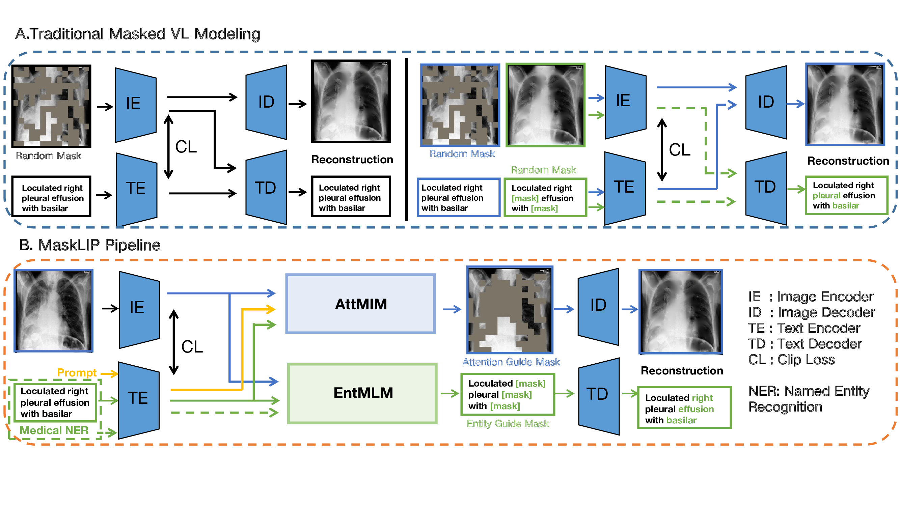

# XLIP: Cross-modal Attention Masked Modelling for Medical Language-Image Pre-Training

Author: [Biao Wu](https://scholar.google.com/citations?user=Y3SBBWMAAAAJ&hl=en)\*, [Yutong Xie](https://scholar.google.com/citations?user=ddDL9HMAAAAJ&hl=zh-CN)\*, [Zeyu Zhang](https://steve-zeyu-zhang.github.io/), [Minh Hieu Phan](https://scholar.google.com/citations?user=gSEw8EsAAAAJ&hl=en), [Qi Chen](https://scholar.google.com/citations?user=OgKU77kAAAAJ&hl=zh-CN), [Ling Chen](https://scholar.google.com.au/citations?hl=en&user=L5aYWQcAAAAJ&view_op=list_works&sortby=pubdate), [Qi Wu](https://scholar.google.co.uk/citations?user=aKXe1FEAAAAJ&hl=en)⁺

*Contributed Equally. ⁺Corresponding author: qi.wu01@adelaide.edu.au.




## Introduction

XLIP (X-ray Language-Image Pre-training) is a multimodal model designed to bridge the gap between medical text and X-ray images. Inspired by OpenAI's CLIP, XLIP aims to provide a unified feature space for both text and images, specifically focusing on the medical domain.

## Features

- **Multimodal Understanding**: XLIP is trained to understand both text and X-ray images, facilitating various downstream medical tasks.
- **Domain-Specific**: Unlike general-purpose models, XLIP is trained on a specialized dataset of medical text and X-ray images.
- **Easy to Use**: With a simple API and clear documentation, integrating XLIP into your workflow is seamless.

## Requirements

- Python >= 3.7
- PyTorch >= 1.8
- CUDA-compatible GPU (optional but recommended)

## Installation

To install XLIP, you can clone this repository and install the required packages.

```bash
git clone https://github.com/your_username/XLIP.git
cd XLIP
pip install -r requirements.txt
```

## Quick Start

To encode an X-ray image and a medical text snippet into the same feature space, you can use the following code:

```python
from xlip import XLIPModel

# Initialize model
model = XLIPModel()

# Sample X-ray image and text
xray_image = "path/to/xray/image.jpg"
medical_text = "This X-ray shows signs of pneumonia."

# Encode into feature space
image_features, text_features = model.encode(xray_image, medical_text)
```

## Contributing

We welcome contributions to XLIP! If you have a feature request, bug report, or want to contribute code, please open an issue or pull request.

## License

This project is licensed under the MIT License - see the [LICENSE](LICENSE) file for details.

--- 
